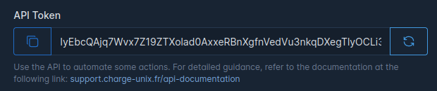

<!DOCTYPE html>
<html lang="en">
<head>
    <meta charset="UTF-8">
    <meta name="viewport" content="width=device-width, initial-scale=1.0">
    <title>API Documentation</title>
    <link href="https://maxcdn.bootstrapcdn.com/bootstrap/4.5.2/css/bootstrap.min.css" rel="stylesheet">
    <link rel="stylesheet" href="https://cdnjs.cloudflare.com/ajax/libs/highlight.js/11.9.0/styles/default.min.css">
    
</head>
<body>

    <h1 class="mb-4">Charge Unix Hub API Documentation</h1>

    <h2>Authentification</h2>
    
Charge Unix Hub API use token to authenticate users. You can generate your personal token on your profile
        page.

    

        
        
    

    
There are several ways of passing the API token to the Charge Unix Hub API. We'll discuss each of these
        approaches while using the PHP Guzzle HTTP library and Python requests library to demonstrate their usage. You
        may choose any of these approaches based on the needs of your application.

    <h3>Query String</h3>
    
Your application's API consumers may specify their token as an api_token query string value:

    <pre><code lang="php">
$response = $client->request('GET', '/api/user/data?api_token='.$token);
    </code></pre>
    <pre><code lang="python">
response = requests.get('http://&lt;ip&gt;/api/user/data?api_token=%s' % token)
    </code></pre>

    <h3>Request Payload</h3>
    
Your application's API consumers may include their API token in the request's form parameters as an <strong>api_token</strong>:
    

    <pre><code lang="php">
$response = $client->request('POST', '/api/user', [
    'headers' => [
        'Accept' => 'application/json',
    ],
    'form_params' => [
        'api_token' => $token,
    ],
]);
    </code></pre>
    <pre><code lang="python">
response = requests.post('http://&lt;ip&gt;/api/users', {
    'api_token': token
}, headers={
    'Accept': 'application/json'
})
    </code></pre>

    <h3>Bearer Token</h3>
    
Your application's API consumers may provide their API token as a Bearer token in the
        <strong>Authorization</strong> header of the request:

    <pre><code lang="php">
$response = $client->request('POST', '/api/user', [
    'headers' => [
        'Authorization' => 'Bearer '.$token,
        'Accept' => 'application/json',
    ],
]);
    </code></pre>
    <pre><code lang="python">
response = requests.post('http://&lt;ip&gt;/api/users', {
    'limit': 10
}, headers={
    'Authorization': 'Bearer %s' % token,
    'Accept': 'application/json'
})
    </code></pre>

    

    <h2>Examples</h2>

    <pre><code lang="python">import requests

hostname = 'b56eb213-eb06-42e6-9e30-60c56939a520.remote.charge-unix.fr' # With remote access
# hostname = '192.168.1.53' # on LAN

api_token = 'IyEbcQAjq7Wvx7Z19ZTXolad0AxxeRBnXgfnVedVu3nkqDXegTlyOCLi3yqr9Cy12oAchVxKkQNUpwZV'

identity = 'place1-2-3'

response = requests.post(f'https://{hostname}/api/charging-station/{identity}/command', verify=False, json={
    'action': 'Reset',
    'payload': {
        'type': 'Soft'
    }
}, headers={
    'Authorization': 'Bearer %s' % api_token,
    'Accept': 'application/json'
})

print(response.json())
</code></pre>
    <pre><code lang="json">{
    "response": {
        "uniqueId": "ae5b97da-9a08-42e0-ad67-44b9f853caae",
        "payload": {
            "status": "Accepted"
        }
    },
    "request": {
        "uniqueId": "ae5b97da-9a08-42e0-ad67-44b9f853caae",
        "action": "Reset",
        "payload": {
            "type": "Soft"
        }
    }
}

</code></pre>
    <pre><code lang="python">response = requests.get(f'https://{hostname}/api/charging-station/data', verify=False, json={
    'limit': 5,
    'search': 'place4',
    'with': ['connectors']
}, headers={
    'Authorization': 'Bearer %s' % api_token,
    'Accept': 'application/json'
})
print(response.json())

</code></pre>
    <pre><code lang="json">[
    {
      "identity": "place4-5",
      "name": "Place 4 et 5",
      "connected": false,
      "operatorUrl": null,
      "operatorConnected": 0,
      "operatorDisconnectedPolicy": "ALLOW_ALL",
      "operatorHeartbeatMinimumInterval": 420,
      "operatorMetervaluesMinimumInterval": 300,
      "chargePointVendor": "Simulator",
      "chargePointModel": "ChargePointSimulator",
      "chargeBoxSerialNumber": "CBCN1234567890",
      "chargePointSerialNumber": "CPCN1234567890",
      "firmwareVersion": "1.0.0",
      "iccid": "891460000000000012",
      "imsi": "313460000000001",
      "meterSerialNumber": "NSN134567890",
      "meterType": "Software",
      "ipAddress": "127.0.0.1",
      "zoneId": 3,
      "vip": false,
      "currentLimit": null,
      "version": "V16",
      "lastHeartbeat": "2024-06-06T16:32:43.000000Z",
      "createdAt": "2024-04-05T15:17:36.000000Z",
      "updatedAt": "2024-06-06T17:00:58.000000Z",
      "connectors": [
        {
          "id": 1,
          "chargingStationIdentity": "place4-5",
          "status": "Available",
          "info": null,
          "errorCode": "NoError",
          "vendorId": null,
          "vendorErrorCode": null,
          "wiring": "123",
          "freeValue": 32,
          "standard": "IEC61851",
          "type": "T2",
          "sheddingType": {
            "type": "SetChargingProfile",
            "args": {
              "purpose": "TxProfile",
              "chargingProfileId": 1,
              "stackLevel": 0,
              "numberPhases": false,
              "chargingRateUnit": "A"
            }
          },
          "equipmentId": null,
          "limit": null,
          "createdAt": "2024-04-05T15:17:36.000000Z",
          "updatedAt": "2024-05-28T16:14:54.000000Z"
        },
        {
          "id": 2,
          "chargingStationIdentity": "place4-5",
          "status": "Available",
          "info": null,
          "errorCode": "NoError",
          "vendorId": null,
          "vendorErrorCode": null,
          "wiring": "123",
          "freeValue": 32,
          "standard": "IEC61851",
          "type": "T2",
          "sheddingType": {
            "type": "SetChargingProfile",
            "args": {
              "purpose": "TxProfile",
              "chargingProfileId": 1,
              "stackLevel": 0,
              "numberPhases": false,
              "chargingRateUnit": "A"
            }
          },
          "equipmentId": null,
          "limit": null,
          "createdAt": "2024-04-05T15:17:36.000000Z",
          "updatedAt": "2024-05-28T16:14:59.000000Z"
        }
      ]
    }
]

</code></pre>

    

    <h2>End Points</h2>

    

        <table class="table table-bordered table-hover">
            <thead class="thead-dark">
            <tr>
                <th style="width: 7%">Admin Only</th>
                <th style="width: 8%">Method</th>
                <th style="width: 30%">URI</th>
                <th style="width: 15%">Name</th>
                <th style="width: 40%">Parameters</th>
            </tr>
            </thead>
            <tbody>
            <tr>
                <td>No</td>
                <td>GET|POST</td>
                <td>/api/charging-station/paginate</td>
                <td>Charging station paginate</td>
                <td>
                    <ul>
                        <li>
                            <strong>perPage:</strong> nullable|int|min:1|max:1000
                        </li>
                        <li>
                            <strong>order:</strong> nullable|array
                        </li>
                        <li>
                            <strong>order.column:</strong> required_with:order|string
                        </li>
                        <li>
                            <strong>order.direction:</strong> required_with:order|in:0,1
                        </li>
                        <li>
                            <strong>search:</strong> nullable|string
                        </li>
                        <li>
                            <strong>with:</strong> nullable|array
                        </li>
                        <li>
                            <strong>with.*:</strong> string
                        </li>
                    </ul>
                </td>
            </tr>

            <tr>
                <td>No</td>
                <td>GET|POST</td>
                <td>/api/charging-station/data</td>
                <td>Charging station data</td>
                <td>
                    <ul>
                        <li>
                            <strong>limit:</strong> nullable|integer
                        </li>
                        <li>
                            <strong>offset:</strong> nullable|integer
                        </li>
                        <li>
                            <strong>with:</strong> nullable|array|min:0
                        </li>
                        <li>
                            <strong>with.*:</strong> string
                        </li>
                    </ul>
                </td>
            </tr>
            <tr>
                <td>Yes</td>
                <td>GET|POST</td>
                <td>/api/charging-station/create</td>
                <td>Charging station data</td>
                <td>
                    <ul>
                        <li>
                            <strong>identity:</strong>
                            required|string|max:100|unique:charging_stations,identity|regex:/^[a-zA-Z0-9\-\_:\.\@\[\]\(\),]+$/
                        </li>
                        <li>
                            <strong>name:</strong> required|string|max:100|unique:charging_stations,name
                        </li>
                        <li>
                            <strong>zoneId:</strong> nullable|exists:zones,id
                        </li>
                        <li>
                            <strong>currentLimit:</strong> nullable|integer|min:0|max:65535
                        </li>
                        <li>
                            <strong>operatorUrl:</strong> nullable|string|url:ws,wss
                        </li>
                        <li>
                            <strong>operatorDisconnectedPolicy:</strong> required|in:ALLOW_ALL,DENY_ALL,INTERNAL
                        </li>
                        <li>
                            <strong>vip:</strong> required|boolean
                        </li>
                        <li>
                            <strong>connectors:</strong> nullable|integer|min:0|max:64
                        </li>
                    </ul>
                </td>
            </tr>
            <tr>
                <td>No</td>
                <td>GET|POST</td>
                <td>/api/charging-station/{chargingstation.identity}/detail</td>
                <td>Charging station detail</td>
                <td>
                    <ul>
                        <li>
                            <strong>with:</strong> nullable|array
                        </li>
                        <li>
                            <strong>with.*:</strong> string
                        </li>
                    </ul>
                </td>
            </tr>
            <tr>
                <td>Yes</td>
                <td>GET|POST</td>
                <td>/api/charging-station/{model}/update</td>
                <td>Charging station update</td>
                <td>
                    <ul>
                        <li>
                            <strong>identity:</strong>
                            required|string|max:100|unique:charging_stations,identity|regex:/^[a-zA-Z0-9\-\_:\.\@\[\]\(\),]+$/
                        </li>
                        <li>
                            <strong>name:</strong> required|string|max:100|unique:charging_stations,name
                        </li>
                        <li>
                            <strong>zoneId:</strong> nullable|exists:zones,id
                        </li>
                        <li>
                            <strong>currentLimit:</strong> nullable|integer|min:0|max:65535
                        </li>
                        <li>
                            <strong>operatorUrl:</strong> nullable|string|url:ws,wss
                        </li>
                        <li>
                            <strong>operatorDisconnectedPolicy:</strong> required|in:ALLOW_ALL,DENY_ALL,INTERNAL
                        </li>
                        <li>
                            <strong>vip:</strong> required|boolean
                        </li>
                        <li>
                            <strong>connectors:</strong> nullable|integer|min:0|max:64
                        </li>
                    </ul>
                </td>
            </tr>
            <tr>
                <td>No</td>
                <td>GET|POST</td>
                <td>/api/charging-station/{chargingstation.identity}/delete</td>
                <td>Charging station delete</td>
                <td>
                </td>
            </tr>
            <tr>
                <td>Yes</td>
                <td>GET</td>
                <td>/api/charging-station/{chargingstation.identity}/configuration</td>
                <td>Charging station configuration get</td>
                <td>
                </td>
            </tr>
            <tr>
                <td>Yes</td>
                <td>POST</td>
                <td>/api/charging-station/{chargingstation.identity}/configuration</td>
                <td>Charging station configuration set</td>
                <td>
                    <ul>
                        <li>
                            <strong>key:</strong> required|string
                        </li>
                        <li>
                            <strong>value:</strong> nullable|string
                        </li>
                    </ul>
                </td>
            </tr>
            <tr>
                <td>Yes</td>
                <td>POST</td>
                <td>/api/charging-station/{chargingstation.identity}/reset</td>
                <td>Charging station reset</td>
                <td>
                    <ul>
                        <li>
                            <strong>soft:</strong> nullable|boolean
                        </li>
                    </ul>
                </td>
            </tr>
            <tr>
                <td>Yes</td>
                <td>GET</td>
                <td>/api/charging-station/{chargingstation.identity}/commands</td>
                <td>Charging station commands</td>
                <td>
                </td>
            </tr>
            <tr>
                <td>Yes</td>
                <td>POST</td>
                <td>/api/charging-station/{chargingstation.identity}/command</td>
                <td>Charging station command</td>
                <td>
                    <ul>
                        <li>
                            <strong>action:</strong> required|string
                        </li>
                        <li>
                            <strong>payload:</strong> nullable|array
                        </li>
                    </ul>
                </td>
            </tr>
            <tr>
                <td>Yes</td>
                <td>POST</td>
                <td>/api/charging-station/{chargingstation.identity}/connectors/update</td>
                <td>Charging station connectors update</td>
                <td>
                    <ul>
                        <li>
                            <strong>connectors:</strong> array|required|max:64|min:0
                        </li>
                        <li>
                            <strong>connectors.*.id:</strong> required|integer
                        </li>
                        <li>
                            <strong>connectors.*.type:</strong> required|string|in:T2,TE,CCS,CHAdeMO
                        </li>
                        <li>
                            <strong>connectors.*.freeValue:</strong> required|numeric
                        </li>
                        <li>
                            <strong>connectors.*.wiring:</strong> required|string|in:123,132,213,231,312,321,1,2,3
                        </li>
                        <li>
                            <strong>connectors.*.standard:</strong> required|string|in:IEC61851,EV_ZE_Ready,DC_CHARGER
                        </li>
                        <li>
                            <strong>connectors.*.sheddingType:</strong> nullable|array
                        </li>
                        <li>
                            <strong>connectors.*.equipmentId:</strong> nullable|exists:equipments,id
                        </li>
                    </ul>
                </td>
            </tr>
            <tr>
                <td>No</td>
                <td>POST</td>
                <td>/api/charging-station/{chargingstation.identity}/export</td>
                <td>Charging station export</td>
                <td>
                    <ul>
                        <li>
                            <strong>start:</strong> required|date
                        </li>
                        <li>
                            <strong>end:</strong> required|date
                        </li>
                        <li>
                            <strong>timezone:</strong> nullable|in:&lt;timezone identifiers&gt;
                        </li>
                    </ul>
                </td>
            </tr>
            <tr>
                <td>No</td>
                <td>GET|POST</td>
                <td>/api/configuration/paginate</td>
                <td>Configuration paginate</td>
                <td>
                    <ul>
                        <li>
                            <strong>perPage:</strong> nullable|int|min:1|max:1000
                        </li>
                        <li>
                            <strong>order:</strong> nullable|array
                        </li>
                        <li>
                            <strong>order.column:</strong> required_with:order|string
                        </li>
                        <li>
                            <strong>order.direction:</strong> required_with:order|in:0,1
                        </li>
                        <li>
                            <strong>search:</strong> nullable|string
                        </li>
                        <li>
                            <strong>with:</strong> nullable|array
                        </li>
                        <li>
                            <strong>with.*:</strong> string
                        </li>
                    </ul>
                </td>
            </tr>
            <tr>
                <td>No</td>
                <td>GET|POST</td>
                <td>/api/configuration/data</td>
                <td>Configuration data</td>
                <td>
                    <ul>
                        <li>
                            <strong>limit:</strong> nullable|integer
                        </li>
                        <li>
                            <strong>offset:</strong> nullable|integer
                        </li>
                        <li>
                            <strong>with:</strong> nullable|array|min:0
                        </li>
                        <li>
                            <strong>with.*:</strong> string
                        </li>
                    </ul>
                </td>
            </tr>
            <tr>
                <td>Yes</td>
                <td>GET|POST</td>
                <td>/api/configuration/create</td>
                <td>Configuration data</td>
                <td>
                    <ul>
                        <li>
                            <strong>chargingStationIdentity:</strong> required|exists:charging_stations,identity
                        </li>
                        <li>
                            <strong>key:</strong> required|string|min:1|max:191
                        </li>
                        <li>
                            <strong>value:</strong> required|string|min:1|max:500
                        </li>
                    </ul>
                </td>
            </tr>
            <tr>
                <td>No</td>
                <td>GET|POST</td>
                <td>/api/configuration/{settings.id}/detail</td>
                <td>Configuration detail</td>
                <td>
                    <ul>
                        <li>
                            <strong>with:</strong> nullable|array
                        </li>
                        <li>
                            <strong>with.*:</strong> string
                        </li>
                    </ul>
                </td>
            </tr>
            <tr>
                <td>Yes</td>
                <td>GET|POST</td>
                <td>/api/configuration/{model}/update</td>
                <td>Configuration update</td>
                <td>
                    <ul>
                        <li>
                            <strong>chargingStationIdentity:</strong> required|exists:charging_stations,identity
                        </li>
                        <li>
                            <strong>key:</strong> required|string|min:1|max:191
                        </li>
                        <li>
                            <strong>value:</strong> required|string|min:1|max:500
                        </li>
                    </ul>
                </td>
            </tr>
            <tr>
                <td>No</td>
                <td>GET|POST</td>
                <td>/api/configuration/{settings.id}/delete</td>
                <td>Configuration delete</td>
                <td>
                </td>
            </tr>
            <tr>
                <td>No</td>
                <td>GET|POST</td>
                <td>/api/connector/paginate</td>
                <td>Connector paginate</td>
                <td>
                    <ul>
                        <li>
                            <strong>perPage:</strong> nullable|int|min:1|max:1000
                        </li>
                        <li>
                            <strong>order:</strong> nullable|array
                        </li>
                        <li>
                            <strong>order.column:</strong> required_with:order|string
                        </li>
                        <li>
                            <strong>order.direction:</strong> required_with:order|in:0,1
                        </li>
                        <li>
                            <strong>search:</strong> nullable|string
                        </li>
                        <li>
                            <strong>with:</strong> nullable|array
                        </li>
                        <li>
                            <strong>with.*:</strong> string
                        </li>
                    </ul>
                </td>
            </tr>
            <tr>
                <td>No</td>
                <td>GET|POST</td>
                <td>/api/connector/data</td>
                <td>Connector data</td>
                <td>
                    <ul>
                        <li>
                            <strong>limit:</strong> nullable|integer
                        </li>
                        <li>
                            <strong>offset:</strong> nullable|integer
                        </li>
                        <li>
                            <strong>with:</strong> nullable|array|min:0
                        </li>
                        <li>
                            <strong>with.*:</strong> string
                        </li>
                    </ul>
                </td>
            </tr>
            <tr>
                <td>Yes</td>
                <td>GET|POST</td>
                <td>/api/connector/create</td>
                <td>Connector data</td>
                <td>
                </td>
            </tr>
            <tr>
                <td>No</td>
                <td>GET|POST</td>
                <td>/api/connector/{chargingstation.identity}-{connector.id}/detail</td>
                <td>Connector detail</td>
                <td>
                    <ul>
                        <li>
                            <strong>with:</strong> nullable|array
                        </li>
                        <li>
                            <strong>with.*:</strong> string
                        </li>
                    </ul>
                </td>
            </tr>
            <tr>
                <td>Yes</td>
                <td>GET|POST</td>
                <td>/api/connector/{model}/update</td>
                <td>Connector update</td>
                <td>
                </td>
            </tr>
            <tr>
                <td>No</td>
                <td>GET|POST</td>
                <td>/api/connector/{chargingstation.identity}-{connector.id}/delete</td>
                <td>Connector delete</td>
                <td>
                </td>
            </tr>
            <tr>
                <td>Yes</td>
                <td>GET|POST</td>
                <td>/api/connector/shedding-types</td>
                <td>Connector shedding types</td>
                <td>
                </td>
            </tr>
            <tr>
                <td>Yes</td>
                <td>GET|POST</td>
                <td>/api/connector/{chargingstation.identity}-{connector.id}/availability</td>
                <td>Connector availability</td>
                <td>
                    <ul>
                        <li>
                            <strong>availability:</strong> required|string|in:Inoperative,Operative
                        </li>
                    </ul>
                </td>
            </tr>
            <tr>
                <td>Yes</td>
                <td>GET|POST</td>
                <td>/api/connector/{chargingstation.identity}-{connector.id}/refresh</td>
                <td>Connector refresh</td>
                <td>
                </td>
            </tr>
            <tr>
                <td>Yes</td>
                <td>GET|POST</td>
                <td>/api/connector/{chargingstation.identity}-{connector.id}/transaction/start</td>
                <td>Connector transaction start</td>
                <td>
                    <ul>
                        <li>
                            <strong>tagId:</strong> required|exists:tags,id
                        </li>
                    </ul>
                </td>
            </tr>
            <tr>
                <td>Yes</td>
                <td>GET|POST</td>
                <td>/api/connector/{chargingstation.identity}-{connector.id}/transaction/stop</td>
                <td>Connector transaction stop</td>
                <td>
                </td>
            </tr>
            <tr>
                <td>No</td>
                <td>GET|POST</td>
                <td>/api/equipment/paginate</td>
                <td>Equipment paginate</td>
                <td>
                    <ul>
                        <li>
                            <strong>perPage:</strong> nullable|int|min:1|max:1000
                        </li>
                        <li>
                            <strong>order:</strong> nullable|array
                        </li>
                        <li>
                            <strong>order.column:</strong> required_with:order|string
                        </li>
                        <li>
                            <strong>order.direction:</strong> required_with:order|in:0,1
                        </li>
                        <li>
                            <strong>search:</strong> nullable|string
                        </li>
                        <li>
                            <strong>with:</strong> nullable|array
                        </li>
                        <li>
                            <strong>with.*:</strong> string
                        </li>
                    </ul>
                </td>
            </tr>
            <tr>
                <td>No</td>
                <td>GET|POST</td>
                <td>/api/equipment/data</td>
                <td>Equipment data</td>
                <td>
                    <ul>
                        <li>
                            <strong>limit:</strong> nullable|integer
                        </li>
                        <li>
                            <strong>offset:</strong> nullable|integer
                        </li>
                        <li>
                            <strong>with:</strong> nullable|array|min:0
                        </li>
                        <li>
                            <strong>with.*:</strong> string
                        </li>
                    </ul>
                </td>
            </tr>
            <tr>
                <td>Yes</td>
                <td>GET|POST</td>
                <td>/api/equipment/create</td>
                <td>Equipment data</td>
                <td>
                    <ul>
                        <li>
                            <strong>name:</strong> required|string|unique:equipments|max:100
                        </li>
                        <li>
                            <strong>productId:</strong> required|exists:products,id
                        </li>
                        <li>
                            <strong>ipAddress:</strong> required|ipv4
                        </li>
                        <li>
                            <strong>port:</strong> required|integer|min:1|max:65535
                        </li>
                        <li>
                            <strong>slaveId:</strong> required|integer|min:0|max:255
                        </li>
                    </ul>
                </td>
            </tr>
            <tr>
                <td>No</td>
                <td>GET|POST</td>
                <td>/api/equipment/{equipment.id}/detail</td>
                <td>Equipment detail</td>
                <td>
                    <ul>
                        <li>
                            <strong>with:</strong> nullable|array
                        </li>
                        <li>
                            <strong>with.*:</strong> string
                        </li>
                    </ul>
                </td>
            </tr>
            <tr>
                <td>Yes</td>
                <td>GET|POST</td>
                <td>/api/equipment/{model}/update</td>
                <td>Equipment update</td>
                <td>
                    <ul>
                        <li>
                            <strong>name:</strong> required|string|unique:equipments|max:100
                        </li>
                        <li>
                            <strong>productId:</strong> required|exists:products,id
                        </li>
                        <li>
                            <strong>ipAddress:</strong> required|ipv4
                        </li>
                        <li>
                            <strong>port:</strong> required|integer|min:1|max:65535
                        </li>
                        <li>
                            <strong>slaveId:</strong> required|integer|min:0|max:255
                        </li>
                    </ul>
                </td>
            </tr>
            <tr>
                <td>No</td>
                <td>GET|POST</td>
                <td>/api/equipment/{equipment.id}/delete</td>
                <td>Equipment delete</td>
                <td>
                </td>
            </tr>
            <tr>
                <td>No</td>
                <td>GET|POST</td>
                <td>/api/equipment/{equipment.id}/values</td>
                <td>Equipment variables</td>
                <td>
                </td>
            </tr>
            <tr>
                <td>No</td>
                <td>GET|POST</td>
                <td>/api/equipment/{equipment.id}/export</td>
                <td>Equipment export</td>
                <td>
                    <ul>
                        <li>
                            <strong>variables:</strong> array|required|min:1
                        </li>
                        <li>
                            <strong>variables.*:</strong> required|in:&lt;equipment variable ids&gt;
                        </li>
                        <li>
                            <strong>start:</strong> required|date
                        </li>
                        <li>
                            <strong>end:</strong> required|date
                        </li>
                        <li>
                            <strong>timezone:</strong> nullable|in:&lt;timezone identifiers&gt;
                        </li>
                    </ul>
                </td>
            </tr>
            <tr>
                <td>No</td>
                <td>GET|POST</td>
                <td>/api/equipment/{equipment.id}/chart</td>
                <td>Equipment chart</td>
                <td>
                    <ul>
                        <li>
                            <strong>chart:</strong> required|in:&quot;Current&quot;,&quot;Active power&quot;
                        </li>
                        <li>
                            <strong>start:</strong> required|date
                        </li>
                        <li>
                            <strong>end:</strong> required|date
                        </li>
                        <li>
                            <strong>timezone:</strong> nullable|in:&lt;timezone identifiers&gt;
                        </li>
                    </ul>
                </td>
            </tr>
            <tr>
                <td>No</td>
                <td>GET|POST</td>
                <td>/api/equipment-log/paginate</td>
                <td>Equipment log paginate</td>
                <td>
                    <ul>
                        <li>
                            <strong>perPage:</strong> nullable|int|min:1|max:1000
                        </li>
                        <li>
                            <strong>order:</strong> nullable|array
                        </li>
                        <li>
                            <strong>order.column:</strong> required_with:order|string
                        </li>
                        <li>
                            <strong>order.direction:</strong> required_with:order|in:0,1
                        </li>
                        <li>
                            <strong>search:</strong> nullable|string
                        </li>
                        <li>
                            <strong>with:</strong> nullable|array
                        </li>
                        <li>
                            <strong>with.*:</strong> string
                        </li>
                    </ul>
                </td>
            </tr>
            <tr>
                <td>No</td>
                <td>GET|POST</td>
                <td>/api/equipment-log/data</td>
                <td>Equipment log data</td>
                <td>
                    <ul>
                        <li>
                            <strong>limit:</strong> nullable|integer
                        </li>
                        <li>
                            <strong>offset:</strong> nullable|integer
                        </li>
                        <li>
                            <strong>with:</strong> nullable|array|min:0
                        </li>
                        <li>
                            <strong>with.*:</strong> string
                        </li>
                    </ul>
                </td>
            </tr>
            <tr>
                <td>Yes</td>
                <td>GET|POST</td>
                <td>/api/equipment-log/create</td>
                <td>Equipment log data</td>
                <td>
                </td>
            </tr>
            <tr>
                <td>No</td>
                <td>GET|POST</td>
                <td>/api/equipment-log/{equipmentlog.id}/detail</td>
                <td>Equipment log detail</td>
                <td>
                    <ul>
                        <li>
                            <strong>with:</strong> nullable|array
                        </li>
                        <li>
                            <strong>with.*:</strong> string
                        </li>
                    </ul>
                </td>
            </tr>
            <tr>
                <td>Yes</td>
                <td>GET|POST</td>
                <td>/api/equipment-log/{model}/update</td>
                <td>Equipment log update</td>
                <td>
                </td>
            </tr>
            <tr>
                <td>No</td>
                <td>GET|POST</td>
                <td>/api/equipment-log/{equipmentlog.id}/delete</td>
                <td>Equipment log delete</td>
                <td>
                </td>
            </tr>
            <tr>
                <td>Yes</td>
                <td>GET|POST</td>
                <td>/api/jailed-charging-station</td>
                <td>Jailed charging station data</td>
                <td>
                </td>
            </tr>
            <tr>
                <td>Yes</td>
                <td>GET|POST</td>
                <td>/api/jailed-charging-station/register</td>
                <td>Jailed charging station register</td>
                <td>
                    <ul>
                        <li>
                            <strong>identity:</strong> required|string|max:100|unique:charging_stations,identity
                        </li>
                        <li>
                            <strong>name:</strong> required|string|max:100|unique:charging_stations,name
                        </li>
                        <li>
                            <strong>zoneId:</strong> nullable|exists:zones,id
                        </li>
                        <li>
                            <strong>currentLimit:</strong> nullable|integer|min:0|max:65535
                        </li>
                        <li>
                            <strong>operatorUrl:</strong> nullable|string|url:ws,wss
                        </li>
                        <li>
                            <strong>operatorDisconnectedPolicy:</strong> required|in:ALLOW_ALL,DENY_ALL,INTERNAL
                        </li>
                        <li>
                            <strong>operatorHeartbeatMinimumInterval:</strong> nullable|integer|min:0|max:65535
                        </li>
                        <li>
                            <strong>operatorMetervaluesMinimumInterval:</strong> nullable|integer|min:0|max:65535
                        </li>
                        <li>
                            <strong>vip:</strong> required|boolean
                        </li>
                        <li>
                            <strong>restart:</strong> required|boolean
                        </li>
                        <li>
                            <strong>chargePoints:</strong> required|array
                        </li>
                        <li>
                            <strong>chargePoints.*.connectorId:</strong> required|integer
                        </li>
                        <li>
                            <strong>chargePoints.*.type:</strong> required|string|in:T2,TE,CCS,CHAdeMO
                        </li>
                        <li>
                            <strong>chargePoints.*.wiring:</strong> required|string|in:123,132,213,231,312,321,1,2,3
                        </li>
                        <li>
                            <strong>chargePoints.*.freeValue:</strong> required|numeric
                        </li>
                        <li>
                            <strong>chargePoints.*.standard:</strong> required|string|in:IEC61851,EV_ZE_Ready,DC_CHARGER
                        </li>
                        <li>
                            <strong>chargePoints.*.equipmentId:</strong> nullable|exists:equipments,id
                        </li>
                        <li>
                            <strong>chargePoints.*.manageable:</strong> required|boolean
                        </li>
                    </ul>
                </td>
            </tr>
            <tr>
                <td>No</td>
                <td>GET|POST</td>
                <td>/api/meter-value/paginate</td>
                <td>Meter value paginate</td>
                <td>
                    <ul>
                        <li>
                            <strong>perPage:</strong> nullable|int|min:1|max:1000
                        </li>
                        <li>
                            <strong>order:</strong> nullable|array
                        </li>
                        <li>
                            <strong>order.column:</strong> required_with:order|string
                        </li>
                        <li>
                            <strong>order.direction:</strong> required_with:order|in:0,1
                        </li>
                        <li>
                            <strong>search:</strong> nullable|string
                        </li>
                        <li>
                            <strong>with:</strong> nullable|array
                        </li>
                        <li>
                            <strong>with.*:</strong> string
                        </li>
                    </ul>
                </td>
            </tr>
            <tr>
                <td>No</td>
                <td>GET|POST</td>
                <td>/api/meter-value/data</td>
                <td>Meter value data</td>
                <td>
                    <ul>
                        <li>
                            <strong>limit:</strong> nullable|integer
                        </li>
                        <li>
                            <strong>offset:</strong> nullable|integer
                        </li>
                        <li>
                            <strong>with:</strong> nullable|array|min:0
                        </li>
                        <li>
                            <strong>with.*:</strong> string
                        </li>
                    </ul>
                </td>
            </tr>
            <tr>
                <td>Yes</td>
                <td>GET|POST</td>
                <td>/api/meter-value/create</td>
                <td>Meter value data</td>
                <td>
                    <ul>
                        <li>
                            <strong>chargingStationIdentity:</strong> required|exists:charging_stations,identity
                        </li>
                        <li>
                            <strong>measurand:</strong> required|in:&lt;OCPP Meter Values&gt;
                        </li>
                    </ul>
                </td>
            </tr>
            <tr>
                <td>No</td>
                <td>GET|POST</td>
                <td>/api/meter-value/{metervalue.id}/detail</td>
                <td>Meter value detail</td>
                <td>
                    <ul>
                        <li>
                            <strong>with:</strong> nullable|array
                        </li>
                        <li>
                            <strong>with.*:</strong> string
                        </li>
                    </ul>
                </td>
            </tr>
            <tr>
                <td>Yes</td>
                <td>GET|POST</td>
                <td>/api/meter-value/{model}/update</td>
                <td>Meter value update</td>
                <td>
                    <ul>
                        <li>
                            <strong>chargingStationIdentity:</strong> required|exists:charging_stations,identity
                        </li>
                        <li>
                            <strong>measurand:</strong> required|in:&lt;OCPP Meter Values&gt;
                        </li>
                    </ul>
                </td>
            </tr>
            <tr>
                <td>No</td>
                <td>GET|POST</td>
                <td>/api/meter-value/{metervalue.id}/delete</td>
                <td>Meter value delete</td>
                <td>
                </td>
            </tr>
            <tr>
                <td>No</td>
                <td>GET|POST</td>
                <td>/api/meter-value-log/paginate</td>
                <td>Meter value log paginate</td>
                <td>
                    <ul>
                        <li>
                            <strong>perPage:</strong> nullable|int|min:1|max:1000
                        </li>
                        <li>
                            <strong>order:</strong> nullable|array
                        </li>
                        <li>
                            <strong>order.column:</strong> required_with:order|string
                        </li>
                        <li>
                            <strong>order.direction:</strong> required_with:order|in:0,1
                        </li>
                        <li>
                            <strong>search:</strong> nullable|string
                        </li>
                        <li>
                            <strong>with:</strong> nullable|array
                        </li>
                        <li>
                            <strong>with.*:</strong> string
                        </li>
                    </ul>
                </td>
            </tr>
            <tr>
                <td>No</td>
                <td>GET|POST</td>
                <td>/api/meter-value-log/data</td>
                <td>Meter value log data</td>
                <td>
                    <ul>
                        <li>
                            <strong>limit:</strong> nullable|integer
                        </li>
                        <li>
                            <strong>offset:</strong> nullable|integer
                        </li>
                        <li>
                            <strong>with:</strong> nullable|array|min:0
                        </li>
                        <li>
                            <strong>with.*:</strong> string
                        </li>
                    </ul>
                </td>
            </tr>
            <tr>
                <td>Yes</td>
                <td>GET|POST</td>
                <td>/api/meter-value-log/create</td>
                <td>Meter value log data</td>
                <td>
                </td>
            </tr>
            <tr>
                <td>No</td>
                <td>GET|POST</td>
                <td>/api/meter-value-log/{metervaluelog.id}/detail</td>
                <td>Meter value log detail</td>
                <td>
                    <ul>
                        <li>
                            <strong>with:</strong> nullable|array
                        </li>
                        <li>
                            <strong>with.*:</strong> string
                        </li>
                    </ul>
                </td>
            </tr>
            <tr>
                <td>Yes</td>
                <td>GET|POST</td>
                <td>/api/meter-value-log/{model}/update</td>
                <td>Meter value log update</td>
                <td>
                </td>
            </tr>
            <tr>
                <td>No</td>
                <td>GET|POST</td>
                <td>/api/meter-value-log/{metervaluelog.id}/delete</td>
                <td>Meter value log delete</td>
                <td>
                </td>
            </tr>
            <tr>
                <td>No</td>
                <td>GET|POST</td>
                <td>/api/preference/paginate</td>
                <td>Preference paginate</td>
                <td>
                    <ul>
                        <li>
                            <strong>perPage:</strong> nullable|int|min:1|max:1000
                        </li>
                        <li>
                            <strong>order:</strong> nullable|array
                        </li>
                        <li>
                            <strong>order.column:</strong> required_with:order|string
                        </li>
                        <li>
                            <strong>order.direction:</strong> required_with:order|in:0,1
                        </li>
                        <li>
                            <strong>search:</strong> nullable|string
                        </li>
                        <li>
                            <strong>with:</strong> nullable|array
                        </li>
                        <li>
                            <strong>with.*:</strong> string
                        </li>
                    </ul>
                </td>
            </tr>
            <tr>
                <td>No</td>
                <td>GET|POST</td>
                <td>/api/preference/data</td>
                <td>Preference data</td>
                <td>
                    <ul>
                        <li>
                            <strong>limit:</strong> nullable|integer
                        </li>
                        <li>
                            <strong>offset:</strong> nullable|integer
                        </li>
                        <li>
                            <strong>with:</strong> nullable|array|min:0
                        </li>
                        <li>
                            <strong>with.*:</strong> string
                        </li>
                    </ul>
                </td>
            </tr>
            <tr>
                <td>Yes</td>
                <td>GET|POST</td>
                <td>/api/preference/create</td>
                <td>Preference data</td>
                <td>
                </td>
            </tr>
            <tr>
                <td>No</td>
                <td>GET|POST</td>
                <td>/api/preference/{preference.id}/detail</td>
                <td>Preference detail</td>
                <td>
                    <ul>
                        <li>
                            <strong>with:</strong> nullable|array
                        </li>
                        <li>
                            <strong>with.*:</strong> string
                        </li>
                    </ul>
                </td>
            </tr>
            <tr>
                <td>Yes</td>
                <td>GET|POST</td>
                <td>/api/preference/{model}/update</td>
                <td>Preference update</td>
                <td>
                </td>
            </tr>
            <tr>
                <td>No</td>
                <td>GET|POST</td>
                <td>/api/preference/{preference.id}/delete</td>
                <td>Preference delete</td>
                <td>
                </td>
            </tr>
            <tr>
                <td>No</td>
                <td>GET|POST</td>
                <td>/api/product/paginate</td>
                <td>Product paginate</td>
                <td>
                    <ul>
                        <li>
                            <strong>perPage:</strong> nullable|int|min:1|max:1000
                        </li>
                        <li>
                            <strong>order:</strong> nullable|array
                        </li>
                        <li>
                            <strong>order.column:</strong> required_with:order|string
                        </li>
                        <li>
                            <strong>order.direction:</strong> required_with:order|in:0,1
                        </li>
                        <li>
                            <strong>search:</strong> nullable|string
                        </li>
                        <li>
                            <strong>with:</strong> nullable|array
                        </li>
                        <li>
                            <strong>with.*:</strong> string
                        </li>
                    </ul>
                </td>
            </tr>
            <tr>
                <td>No</td>
                <td>GET|POST</td>
                <td>/api/product/data</td>
                <td>Product data</td>
                <td>
                    <ul>
                        <li>
                            <strong>limit:</strong> nullable|integer
                        </li>
                        <li>
                            <strong>offset:</strong> nullable|integer
                        </li>
                        <li>
                            <strong>with:</strong> nullable|array|min:0
                        </li>
                        <li>
                            <strong>with.*:</strong> string
                        </li>
                    </ul>
                </td>
            </tr>
            <tr>
                <td>Yes</td>
                <td>POST</td>
                <td>/api/product/import</td>
                <td>Product import</td>
                <td>
                    <ul>
                        <li>
                            <strong>file:</strong> required|file|mimes:xlsx
                        </li>
                    </ul>
                </td>
            </tr>
            <tr>
                <td>No</td>
                <td>GET|POST</td>
                <td>/api/product/{product.id}/detail</td>
                <td>Product detail</td>
                <td>
                    <ul>
                        <li>
                            <strong>with:</strong> nullable|array
                        </li>
                        <li>
                            <strong>with.*:</strong> string
                        </li>
                    </ul>
                </td>
            </tr>
            <tr>
                <td>Yes</td>
                <td>GET|POST</td>
                <td>/api/product/{product.id}/export</td>
                <td>Product export</td>
                <td>
                </td>
            </tr>
            <tr>
                <td>No</td>
                <td>POST</td>
                <td>/api/product/{product.id}/delete</td>
                <td>Product delete</td>
                <td>
                </td>
            </tr>
            <tr>
                <td>No</td>
                <td>GET|POST</td>
                <td>/api/product-request/paginate</td>
                <td>Product request paginate</td>
                <td>
                    <ul>
                        <li>
                            <strong>perPage:</strong> nullable|int|min:1|max:1000
                        </li>
                        <li>
                            <strong>order:</strong> nullable|array
                        </li>
                        <li>
                            <strong>order.column:</strong> required_with:order|string
                        </li>
                        <li>
                            <strong>order.direction:</strong> required_with:order|in:0,1
                        </li>
                        <li>
                            <strong>search:</strong> nullable|string
                        </li>
                        <li>
                            <strong>with:</strong> nullable|array
                        </li>
                        <li>
                            <strong>with.*:</strong> string
                        </li>
                    </ul>
                </td>
            </tr>
            <tr>
                <td>No</td>
                <td>GET|POST</td>
                <td>/api/product-request/data</td>
                <td>Product request data</td>
                <td>
                    <ul>
                        <li>
                            <strong>limit:</strong> nullable|integer
                        </li>
                        <li>
                            <strong>offset:</strong> nullable|integer
                        </li>
                        <li>
                            <strong>with:</strong> nullable|array|min:0
                        </li>
                        <li>
                            <strong>with.*:</strong> string
                        </li>
                    </ul>
                </td>
            </tr>
            <tr>
                <td>No</td>
                <td>GET|POST</td>
                <td>/api/product-request/{productrequest.id}/detail</td>
                <td>Product request detail</td>
                <td>
                    <ul>
                        <li>
                            <strong>with:</strong> nullable|array
                        </li>
                        <li>
                            <strong>with.*:</strong> string
                        </li>
                    </ul>
                </td>
            </tr>
            <tr>
                <td>No</td>
                <td>GET|POST</td>
                <td>/api/product-variable/paginate</td>
                <td>Product variable paginate</td>
                <td>
                    <ul>
                        <li>
                            <strong>perPage:</strong> nullable|int|min:1|max:1000
                        </li>
                        <li>
                            <strong>order:</strong> nullable|array
                        </li>
                        <li>
                            <strong>order.column:</strong> required_with:order|string
                        </li>
                        <li>
                            <strong>order.direction:</strong> required_with:order|in:0,1
                        </li>
                        <li>
                            <strong>search:</strong> nullable|string
                        </li>
                        <li>
                            <strong>with:</strong> nullable|array
                        </li>
                        <li>
                            <strong>with.*:</strong> string
                        </li>
                    </ul>
                </td>
            </tr>
            <tr>
                <td>No</td>
                <td>GET|POST</td>
                <td>/api/product-variable/data</td>
                <td>Product variable data</td>
                <td>
                    <ul>
                        <li>
                            <strong>limit:</strong> nullable|integer
                        </li>
                        <li>
                            <strong>offset:</strong> nullable|integer
                        </li>
                        <li>
                            <strong>with:</strong> nullable|array|min:0
                        </li>
                        <li>
                            <strong>with.*:</strong> string
                        </li>
                    </ul>
                </td>
            </tr>
            <tr>
                <td>No</td>
                <td>GET|POST</td>
                <td>/api/product-variable/{productvariable.id}/detail</td>
                <td>Product variable detail</td>
                <td>
                    <ul>
                        <li>
                            <strong>with:</strong> nullable|array
                        </li>
                        <li>
                            <strong>with.*:</strong> string
                        </li>
                    </ul>
                </td>
            </tr>
            <tr>
                <td>Yes</td>
                <td>GET|POST</td>
                <td>/api/system/report</td>
                <td>System report</td>
                <td>
                    <ul>
                        <li>
                            <strong>site:</strong> required|string
                        </li>
                        <li>
                            <strong>notes:</strong> nullable|string
                        </li>
                        <li>
                            <strong>company:</strong> required|string
                        </li>
                        <li>
                            <strong>logo:</strong> nullable|file|image|mimes:jpeg,png,jpg,svg,webp,bmp|max:2048
                        </li>
                        <li>
                            <strong>timezone:</strong> nullable|in:&lt;timezone identifiers&gt;
                        </li>
                        <li>
                            <strong>withTags:</strong> nullable
                        </li>
                    </ul>
                </td>
            </tr>
            <tr>
                <td>Yes</td>
                <td>GET|POST</td>
                <td>/api/system/network</td>
                <td>System network</td>
                <td>
                </td>
            </tr>
            <tr>
                <td>Yes</td>
                <td>POST</td>
                <td>/api/system/network/update</td>
                <td>System network update</td>
                <td>
                    <ul>
                        <li>
                            <strong>eth0:</strong> nullable|array
                        </li>
                        <li>
                            <strong>eth0.dhcp:</strong> required_with:eth0|boolean
                        </li>
                        <li>
                            <strong>eth0.address:</strong> ipv4|required_if:eth0.dhcp,0,false
                        </li>
                        <li>
                            <strong>eth0.netmask:</strong> ipv4|required_if:eth0.dhcp,0,false
                        </li>
                        <li>
                            <strong>eth0.gateway:</strong> ipv4|nullable
                        </li>
                        <li>
                            <strong>eth0.dns:</strong> nullable|array|min:0|max:8
                        </li>
                        <li>
                            <strong>eth0.dns.*:</strong> ipv4
                        </li>
                        <li>
                            <strong>eth0.dhcp-server:</strong> nullable|array
                        </li>
                        <li>
                            <strong>eth0.dhcp-server.start:</strong> required_with:eth0.dhcp-server|int|min:0|max:255
                        </li>
                        <li>
                            <strong>eth0.dhcp-server.end:</strong>
                            required_with:eth0.dhcp-server|int|min:0|max:255|gt:eth0.dhcp-server.start
                        </li>
                        <li>
                            <strong>eth1:</strong> nullable|array
                        </li>
                        <li>
                            <strong>eth1.dhcp:</strong> required_with:eth1|boolean
                        </li>
                        <li>
                            <strong>eth1.address:</strong> ipv4|required_if:eth1.dhcp,0,false
                        </li>
                        <li>
                            <strong>eth1.netmask:</strong> ipv4|required_if:eth1.dhcp,0,false
                        </li>
                        <li>
                            <strong>eth1.gateway:</strong> ipv4|nullable
                        </li>
                        <li>
                            <strong>eth1.dns:</strong> nullable|array|min:0|max:8
                        </li>
                        <li>
                            <strong>eth1.dns.*:</strong> ipv4
                        </li>
                        <li>
                            <strong>eth1.dhcp-server:</strong> nullable|array
                        </li>
                        <li>
                            <strong>eth1.dhcp-server.start:</strong> required_with:eth1.dhcp-server|int|min:0|max:255
                        </li>
                        <li>
                            <strong>eth1.dhcp-server.end:</strong>
                            required_with:eth1.dhcp-server|int|min:0|max:255|gt:eth1.dhcp-server.start
                        </li>
                    </ul>
                </td>
            </tr>
            <tr>
                <td>Yes</td>
                <td>POST</td>
                <td>/api/system/network/{iface}/update</td>
                <td>System network update iface</td>
                <td>
                    <ul>
                        <li>
                            <strong>dhcp:</strong> required|boolean
                        </li>
                        <li>
                            <strong>address:</strong> ipv4|required_if:dhcp,0,false
                        </li>
                        <li>
                            <strong>netmask:</strong> ipv4|required_if:dhcp,0,false
                        </li>
                        <li>
                            <strong>gateway:</strong> ipv4|nullable
                        </li>
                        <li>
                            <strong>dns:</strong> nullable|array|min:0|max:8
                        </li>
                        <li>
                            <strong>dns.*:</strong> ipv4
                        </li>
                        <li>
                            <strong>dhcp-server:</strong> nullable|array
                        </li>
                        <li>
                            <strong>dhcp-server.start:</strong> required_with:dhcp-server|int|min:0|max:255
                        </li>
                        <li>
                            <strong>dhcp-server.end:</strong>
                            required_with:dhcp-server|int|min:0|max:255|gt:dhcp-server.start
                        </li>
                    </ul>
                </td>
            </tr>
            <tr>
                <td>Yes</td>
                <td>GET|POST</td>
                <td>/api/system/network/leases</td>
                <td>System network leases</td>
                <td>
                </td>
            </tr>
            <tr>
                <td>Yes</td>
                <td>GET|POST</td>
                <td>/api/system/network/diagnostic</td>
                <td>System network diagnostic</td>
                <td>
                    <ul>
                        <li>
                            <strong>timeout:</strong> nullable|int|min:100|max:30000
                        </li>
                    </ul>
                </td>
            </tr>
            <tr>
                <td>Yes</td>
                <td>GET|POST</td>
                <td>/api/system/network/ping</td>
                <td>System network ping</td>
                <td>
                    <ul>
                        <li>
                            <strong>target:</strong> required|ip or hostname
                        </li>
                        <li>
                            <strong>timeout:</strong> nullable|int|min:100|max:30000
                        </li>
                    </ul>
                </td>
            </tr>
            <tr>
                <td>Yes</td>
                <td>GET|POST</td>
                <td>/api/system/network/ping/ip</td>
                <td>System network ping ip</td>
                <td>
                    <ul>
                        <li>
                            <strong>ip:</strong> nullable|ip
                        </li>
                        <li>
                            <strong>timeout:</strong> nullable|int|min:100|max:30000
                        </li>
                    </ul>
                </td>
            </tr>
            <tr>
                <td>Yes</td>
                <td>GET|POST</td>
                <td>/api/system/network/ping/hostname</td>
                <td>System network ping hostname</td>
                <td>
                    <ul>
                        <li>
                            <strong>ip:</strong> nullable|string
                        </li>
                        <li>
                            <strong>timeout:</strong> nullable|int|min:100|max:30000
                        </li>
                    </ul>
                </td>
            </tr>
            <tr>
                <td>Yes</td>
                <td>GET|POST</td>
                <td>/api/system/network/ping/cloud</td>
                <td>System network ping cloud</td>
                <td>
                    <ul>
                        <li>
                            <strong>timeout:</strong> nullable|int|min:100|max:30000
                        </li>
                    </ul>
                </td>
            </tr>
            <tr>
                <td>Yes</td>
                <td>GET|POST</td>
                <td>/api/system/device</td>
                <td>System device</td>
                <td>
                </td>
            </tr>
            <tr>
                <td>Yes</td>
                <td>GET|POST</td>
                <td>/api/system/device/cloud</td>
                <td>System device cloud</td>
                <td>
                </td>
            </tr>
            <tr>
                <td>Yes</td>
                <td>GET|POST</td>
                <td>/api/system/device/license</td>
                <td>System device license</td>
                <td>
                    <ul>
                        <li>
                            <strong>token:</strong> required|string
                        </li>
                    </ul>
                </td>
            </tr>
            <tr>
                <td>Yes</td>
                <td>GET|POST</td>
                <td>/api/system/device/datetime</td>
                <td>System device datetime</td>
                <td>
                    <ul>
                        <li>
                            <strong>datetime:</strong> required|date
                        </li>
                    </ul>
                </td>
            </tr>
            <tr>
                <td>Yes</td>
                <td>GET|POST</td>
                <td>/api/system/central-system/logs</td>
                <td>System device central system logs</td>
                <td>
                    <ul>
                        <li>
                            <strong>count:</strong> nullable|int|min:1|max:1024
                        </li>
                        <li>
                            <strong>reverse:</strong> nullable|bool
                        </li>
                        <li>
                            <strong>html:</strong> nullable|bool
                        </li>
                    </ul>
                </td>
            </tr>
            <tr>
                <td>Yes</td>
                <td>GET|POST</td>
                <td>/api/system/logs.zip</td>
                <td>System device logs</td>
                <td>
                </td>
            </tr>
            <tr>
                <td>Yes</td>
                <td>GET|POST</td>
                <td>/api/system/backup.cuhbak</td>
                <td>System device backup</td>
                <td>
                </td>
            </tr>
            <tr>
                <td>Yes</td>
                <td>POST</td>
                <td>/api/system/backup</td>
                <td>System device backup handle</td>
                <td>
                    <ul>
                        <li>
                            <strong>file:</strong> required|file
                        </li>
                    </ul>
                </td>
            </tr>
            <tr>
                <td>Yes</td>
                <td>POST</td>
                <td>/api/system/update</td>
                <td>System device update</td>
                <td>
                    <ul>
                        <li>
                            <strong>file:</strong> required|file|extensions:raucb
                        </li>
                    </ul>
                </td>
            </tr>
            <tr>
                <td>Yes</td>
                <td>POST</td>
                <td>/api/system/device/reboot</td>
                <td>System device reboot</td>
                <td>
                </td>
            </tr>
            <tr>
                <td>Yes</td>
                <td>POST</td>
                <td>/api/system/device/shutdown</td>
                <td>System device shutdown</td>
                <td>
                </td>
            </tr>
            <tr>
                <td>Yes</td>
                <td>POST</td>
                <td>/api/system/device/reset</td>
                <td>System device reset</td>
                <td>
                    <ul>
                        <li>
                            <strong>confirm:</strong> required|boolean
                        </li>
                    </ul>
                </td>
            </tr>
            <tr>
                <td>Yes</td>
                <td>POST</td>
                <td>/api/system/device/cloud/remote/web</td>
                <td>System device cloud remote web</td>
                <td>
                    <ul>
                        <li>
                            <strong>state:</strong> required|boolean
                        </li>
                    </ul>
                </td>
            </tr>
            <tr>
                <td>Yes</td>
                <td>POST</td>
                <td>/api/system/device/cloud/remote/ocpp</td>
                <td>System device cloud remote ocpp</td>
                <td>
                    <ul>
                        <li>
                            <strong>state:</strong> required|boolean
                        </li>
                    </ul>
                </td>
            </tr>
            <tr>
                <td>Yes</td>
                <td>GET</td>
                <td>/api/system/device/license/can-create-charging-station</td>
                <td>System device can create charging station</td>
                <td>
                </td>
            </tr>
            <tr>
                <td>Yes</td>
                <td>POST</td>
                <td>/api/system/device/ssl/certificate</td>
                <td>System device ssl certificate</td>
                <td>
                    <ul>
                        <li>
                            <strong>certificate:</strong> required|file|SSL certificate and private key
                        </li>
                        <li>
                            <strong>private_key:</strong> required|file
                        </li>
                    </ul>
                </td>
            </tr>
            <tr>
                <td>Yes</td>
                <td>GET|POST</td>
                <td>/api/system/nmap</td>
                <td>System nmap</td>
                <td>
                    <ul>
                        <li>
                            <strong>ip:</strong> required|regex:/^(\d{1,3}\.){3}\d{1,3}(\/\d{1,2})?$/
                        </li>
                    </ul>
                </td>
            </tr>
            <tr>
                <td>Yes</td>
                <td>GET|POST</td>
                <td>/api/system/simulator/start</td>
                <td>System simulator start</td>
                <td>
                </td>
            </tr>
            <tr>
                <td>Yes</td>
                <td>GET|POST</td>
                <td>/api/system/simulator/stop</td>
                <td>System simulator stop</td>
                <td>
                </td>
            </tr>
            <tr>
                <td>Yes</td>
                <td>GET|POST</td>
                <td>/api/system/update/online/check</td>
                <td>System update online check</td>
                <td>
                </td>
            </tr>
            <tr>
                <td>Yes</td>
                <td>GET|POST</td>
                <td>/api/system/update/online/install</td>
                <td>System update online install</td>
                <td>
                </td>
            </tr>
            <tr>
                <td>No</td>
                <td>GET|POST</td>
                <td>/api/system-log/paginate</td>
                <td>System log paginate</td>
                <td>
                    <ul>
                        <li>
                            <strong>perPage:</strong> nullable|int|min:1|max:1000
                        </li>
                        <li>
                            <strong>order:</strong> nullable|array
                        </li>
                        <li>
                            <strong>order.column:</strong> required_with:order|string
                        </li>
                        <li>
                            <strong>order.direction:</strong> required_with:order|in:0,1
                        </li>
                        <li>
                            <strong>search:</strong> nullable|string
                        </li>
                        <li>
                            <strong>with:</strong> nullable|array
                        </li>
                        <li>
                            <strong>with.*:</strong> string
                        </li>
                    </ul>
                </td>
            </tr>
            <tr>
                <td>No</td>
                <td>GET|POST</td>
                <td>/api/system-log/data</td>
                <td>System log data</td>
                <td>
                    <ul>
                        <li>
                            <strong>limit:</strong> nullable|integer
                        </li>
                        <li>
                            <strong>offset:</strong> nullable|integer
                        </li>
                        <li>
                            <strong>with:</strong> nullable|array|min:0
                        </li>
                        <li>
                            <strong>with.*:</strong> string
                        </li>
                    </ul>
                </td>
            </tr>
            <tr>
                <td>No</td>
                <td>GET|POST</td>
                <td>/api/system-log/{systemlog.id}/detail</td>
                <td>System log detail</td>
                <td>
                    <ul>
                        <li>
                            <strong>with:</strong> nullable|array
                        </li>
                        <li>
                            <strong>with.*:</strong> string
                        </li>
                    </ul>
                </td>
            </tr>
            <tr>
                <td>No</td>
                <td>GET|POST</td>
                <td>/api/tag/paginate</td>
                <td>Tag paginate</td>
                <td>
                    <ul>
                        <li>
                            <strong>perPage:</strong> nullable|int|min:1|max:1000
                        </li>
                        <li>
                            <strong>order:</strong> nullable|array
                        </li>
                        <li>
                            <strong>order.column:</strong> required_with:order|string
                        </li>
                        <li>
                            <strong>order.direction:</strong> required_with:order|in:0,1
                        </li>
                        <li>
                            <strong>search:</strong> nullable|string
                        </li>
                        <li>
                            <strong>with:</strong> nullable|array
                        </li>
                        <li>
                            <strong>with.*:</strong> string
                        </li>
                    </ul>
                </td>
            </tr>
            <tr>
                <td>No</td>
                <td>GET|POST</td>
                <td>/api/tag/data</td>
                <td>Tag data</td>
                <td>
                    <ul>
                        <li>
                            <strong>limit:</strong> nullable|integer
                        </li>
                        <li>
                            <strong>offset:</strong> nullable|integer
                        </li>
                        <li>
                            <strong>with:</strong> nullable|array|min:0
                        </li>
                        <li>
                            <strong>with.*:</strong> string
                        </li>
                    </ul>
                </td>
            </tr>
            <tr>
                <td>Yes</td>
                <td>POST</td>
                <td>/api/tag/create</td>
                <td>Tag data</td>
                <td>
                    <ul>
                        <li>
                            <strong>id:</strong>
                            required|string|unique:tags,id,NULL,id|regex:/^[a-zA-Z0-9\-\_:\.\@\[\]\(\),]+$/|min:1|max:100
                        </li>
                        <li>
                            <strong>holder:</strong> required|string|min:1|max:100
                        </li>
                        <li>
                            <strong>authorization:</strong> required|string|in:ALLOW_ALL,DENY_ALL,USE_PLANNING
                        </li>
                        <li>
                            <strong>chargingStationAuthorized:</strong> nullable|array
                        </li>
                        <li>
                            <strong>chargingStationAuthorized.*:</strong> string|exists:charging_stations,identity
                        </li>
                        <li>
                            <strong>credit:</strong> nullable|integer
                        </li>
                        <li>
                            <strong>creditRechargePolicy:</strong> nullable|in:AFTER_LAST_USE,PERIODICALLY
                        </li>
                        <li>
                            <strong>creditRechargeDurationType:</strong>
                            required_with:creditRechargePolicy|in:MIN,HOUR,DAY,MONTH,YEAR|nullable
                        </li>
                        <li>
                            <strong>creditRechargeDuration:</strong> required_with:creditRechargePolicy|integer|nullable
                        </li>
                        <li>
                            <strong>creditRechargeAmount:</strong> required_with:creditRechargePolicy|integer|nullable
                        </li>
                        <li>
                            <strong>creditMax:</strong> nullable|integer
                        </li>
                        <li>
                            <strong>vip:</strong> required|boolean
                        </li>
                    </ul>
                </td>
            </tr>
            <tr>
                <td>No</td>
                <td>GET|POST</td>
                <td>/api/tag/{tag.id}/detail</td>
                <td>Tag detail</td>
                <td>
                    <ul>
                        <li>
                            <strong>with:</strong> nullable|array
                        </li>
                        <li>
                            <strong>with.*:</strong> string
                        </li>
                    </ul>
                </td>
            </tr>
            <tr>
                <td>Yes</td>
                <td>POST</td>
                <td>/api/tag/{model}/update</td>
                <td>Tag update</td>
                <td>
                    <ul>
                        <li>
                            <strong>id:</strong>
                            required|string|unique:tags,id,NULL,id|regex:/^[a-zA-Z0-9\-\_:\.\@\[\]\(\),]+$/|min:1|max:100
                        </li>
                        <li>
                            <strong>holder:</strong> required|string|min:1|max:100
                        </li>
                        <li>
                            <strong>authorization:</strong> required|string|in:ALLOW_ALL,DENY_ALL,USE_PLANNING
                        </li>
                        <li>
                            <strong>chargingStationAuthorized:</strong> nullable|array
                        </li>
                        <li>
                            <strong>chargingStationAuthorized.*:</strong> string|exists:charging_stations,identity
                        </li>
                        <li>
                            <strong>credit:</strong> nullable|integer
                        </li>
                        <li>
                            <strong>creditRechargePolicy:</strong> nullable|in:AFTER_LAST_USE,PERIODICALLY
                        </li>
                        <li>
                            <strong>creditRechargeDurationType:</strong>
                            required_with:creditRechargePolicy|in:MIN,HOUR,DAY,MONTH,YEAR|nullable
                        </li>
                        <li>
                            <strong>creditRechargeDuration:</strong> required_with:creditRechargePolicy|integer|nullable
                        </li>
                        <li>
                            <strong>creditRechargeAmount:</strong> required_with:creditRechargePolicy|integer|nullable
                        </li>
                        <li>
                            <strong>creditMax:</strong> nullable|integer
                        </li>
                        <li>
                            <strong>vip:</strong> required|boolean
                        </li>
                    </ul>
                </td>
            </tr>
            <tr>
                <td>No</td>
                <td>POST</td>
                <td>/api/tag/{tag.id}/delete</td>
                <td>Tag delete</td>
                <td>
                </td>
            </tr>
            <tr>
                <td>No</td>
                <td>POST</td>
                <td>/api/tag/{tag.id}/export/xls</td>
                <td>Tag export xls</td>
                <td>
                    <ul>
                        <li>
                            <strong>start:</strong> required|date
                        </li>
                        <li>
                            <strong>end:</strong> required|date
                        </li>
                        <li>
                            <strong>timezone:</strong> nullable|in:&lt;timezone identifiers&gt;
                        </li>
                    </ul>
                </td>
            </tr>
            <tr>
                <td>No</td>
                <td>POST</td>
                <td>/api/tag/{tag.id}/export/pdf</td>
                <td>Tag export pdf</td>
                <td>
                    <ul>
                        <li>
                            <strong>start:</strong> required|date
                        </li>
                        <li>
                            <strong>end:</strong> required|date
                        </li>
                        <li>
                            <strong>timezone:</strong> nullable|in:&lt;timezone identifiers&gt;
                        </li>
                    </ul>
                </td>
            </tr>
            <tr>
                <td>No</td>
                <td>GET|POST</td>
                <td>/api/tag/export</td>
                <td>Tag export</td>
                <td>
                </td>
            </tr>
            <tr>
                <td>No</td>
                <td>GET|POST</td>
                <td>/api/tag/import</td>
                <td>Tag import</td>
                <td>
                    <ul>
                        <li>
                            <strong>file:</strong> required|file|mimes:xls|max:1048576
                        </li>
                        <li>
                            <strong>update:</strong> nullable
                        </li>
                    </ul>
                </td>
            </tr>
            <tr>
                <td>No</td>
                <td>GET|POST</td>
                <td>/api/transaction/paginate</td>
                <td>Transaction paginate</td>
                <td>
                    <ul>
                        <li>
                            <strong>perPage:</strong> nullable|int|min:1|max:1000
                        </li>
                        <li>
                            <strong>order:</strong> nullable|array
                        </li>
                        <li>
                            <strong>order.column:</strong> required_with:order|string
                        </li>
                        <li>
                            <strong>order.direction:</strong> required_with:order|in:0,1
                        </li>
                        <li>
                            <strong>search:</strong> nullable|string
                        </li>
                        <li>
                            <strong>with:</strong> nullable|array
                        </li>
                        <li>
                            <strong>with.*:</strong> string
                        </li>
                    </ul>
                </td>
            </tr>
            <tr>
                <td>No</td>
                <td>GET|POST</td>
                <td>/api/transaction/data</td>
                <td>Transaction data</td>
                <td>
                    <ul>
                        <li>
                            <strong>limit:</strong> nullable|integer
                        </li>
                        <li>
                            <strong>offset:</strong> nullable|integer
                        </li>
                        <li>
                            <strong>with:</strong> nullable|array|min:0
                        </li>
                        <li>
                            <strong>with.*:</strong> string
                        </li>
                    </ul>
                </td>
            </tr>
            <tr>
                <td>No</td>
                <td>GET|POST</td>
                <td>/api/transaction/{transaction.id}/detail</td>
                <td>Transaction detail</td>
                <td>
                    <ul>
                        <li>
                            <strong>with:</strong> nullable|array
                        </li>
                        <li>
                            <strong>with.*:</strong> string
                        </li>
                    </ul>
                </td>
            </tr>
            <tr>
                <td>No</td>
                <td>POST</td>
                <td>/api/transaction/{transaction.id}/terminate</td>
                <td>Transaction terminate</td>
                <td>
                </td>
            </tr>
            <tr>
                <td>No</td>
                <td>POST</td>
                <td>/api/transaction/{transaction.id}/force-terminate</td>
                <td>Transaction force terminate</td>
                <td>
                </td>
            </tr>
            <tr>
                <td>No</td>
                <td>POST</td>
                <td>/api/transaction/export</td>
                <td>Transaction export</td>
                <td>
                    <ul>
                        <li>
                            <strong>start:</strong> required|date
                        </li>
                        <li>
                            <strong>end:</strong> required|date
                        </li>
                        <li>
                            <strong>timezone:</strong> nullable|in:&lt;timezone identifiers&gt;
                        </li>
                    </ul>
                </td>
            </tr>
            <tr>
                <td>No</td>
                <td>GET</td>
                <td>/api/user/me</td>
                <td>User me</td>
                <td>
                </td>
            </tr>
            <tr>
                <td>No</td>
                <td>POST</td>
                <td>/api/user/me/update</td>
                <td>User me update</td>
                <td>
                    <ul>
                        <li>
                            <strong>name:</strong> required|string|min:4|max:100|unique:users,name,1
                        </li>
                        <li>
                            <strong>password:</strong> nullable|string|min:5|max:100|confirmed
                        </li>
                        <li>
                            <strong>password_confirmation:</strong> nullable|same:password
                        </li>
                        <li>
                            <strong>weeklyNotification:</strong> nullable|boolean
                        </li>
                        <li>
                            <strong>monthlyNotification:</strong> nullable|boolean
                        </li>
                        <li>
                            <strong>errorNotification:</strong> nullable|boolean
                        </li>
                        <li>
                            <strong>language:</strong> nullable|string|in:&quot;de&quot;,&quot;en&quot;,&quot;es&quot;,&quot;fr&quot;,&quot;it&quot;
                        </li>
                        <li>
                            <strong>timezone:</strong> nullable|string|timezone
                        </li>
                    </ul>
                </td>
            </tr>
            <tr>
                <td>No</td>
                <td>GET</td>
                <td>/api/user/renew</td>
                <td>User renew</td>
                <td>
                </td>
            </tr>
            <tr>
                <td>No</td>
                <td>GET|POST</td>
                <td>/api/user/paginate</td>
                <td>User paginate</td>
                <td>
                    <ul>
                        <li>
                            <strong>perPage:</strong> nullable|int|min:1|max:1000
                        </li>
                        <li>
                            <strong>order:</strong> nullable|array
                        </li>
                        <li>
                            <strong>order.column:</strong> required_with:order|string
                        </li>
                        <li>
                            <strong>order.direction:</strong> required_with:order|in:0,1
                        </li>
                        <li>
                            <strong>search:</strong> nullable|string
                        </li>
                        <li>
                            <strong>with:</strong> nullable|array
                        </li>
                        <li>
                            <strong>with.*:</strong> string
                        </li>
                    </ul>
                </td>
            </tr>
            <tr>
                <td>No</td>
                <td>GET|POST</td>
                <td>/api/user/data</td>
                <td>User data</td>
                <td>
                    <ul>
                        <li>
                            <strong>limit:</strong> nullable|integer
                        </li>
                        <li>
                            <strong>offset:</strong> nullable|integer
                        </li>
                        <li>
                            <strong>with:</strong> nullable|array|min:0
                        </li>
                        <li>
                            <strong>with.*:</strong> string
                        </li>
                    </ul>
                </td>
            </tr>
            <tr>
                <td>Yes</td>
                <td>GET|POST</td>
                <td>/api/user/create</td>
                <td>User data</td>
                <td>
                    <ul>
                        <li>
                            <strong>name:</strong> required|string|min:4|max:100|unique:users,name
                        </li>
                        <li>
                            <strong>email:</strong> required|email|max:100|unique:users,email
                        </li>
                        <li>
                            <strong>password:</strong> required|string|min:5|confirmed
                        </li>
                        <li>
                            <strong>administrator:</strong> required|boolean
                        </li>
                    </ul>
                </td>
            </tr>
            <tr>
                <td>No</td>
                <td>GET|POST</td>
                <td>/api/user/{user.id}/detail</td>
                <td>User detail</td>
                <td>
                    <ul>
                        <li>
                            <strong>with:</strong> nullable|array
                        </li>
                        <li>
                            <strong>with.*:</strong> string
                        </li>
                    </ul>
                </td>
            </tr>
            <tr>
                <td>Yes</td>
                <td>GET|POST</td>
                <td>/api/user/{model}/update</td>
                <td>User update</td>
                <td>
                    <ul>
                        <li>
                            <strong>name:</strong> required|string|min:4|max:100|unique:users,name
                        </li>
                        <li>
                            <strong>email:</strong> required|email|max:100|unique:users,email
                        </li>
                        <li>
                            <strong>password:</strong> required|string|min:5|confirmed
                        </li>
                        <li>
                            <strong>administrator:</strong> required|boolean
                        </li>
                    </ul>
                </td>
            </tr>
            <tr>
                <td>No</td>
                <td>GET|POST</td>
                <td>/api/user/{user.id}/delete</td>
                <td>User delete</td>
                <td>
                </td>
            </tr>
            <tr>
                <td>No</td>
                <td>GET|POST</td>
                <td>/api/zone/paginate</td>
                <td>Zone paginate</td>
                <td>
                    <ul>
                        <li>
                            <strong>perPage:</strong> nullable|int|min:1|max:1000
                        </li>
                        <li>
                            <strong>order:</strong> nullable|array
                        </li>
                        <li>
                            <strong>order.column:</strong> required_with:order|string
                        </li>
                        <li>
                            <strong>order.direction:</strong> required_with:order|in:0,1
                        </li>
                        <li>
                            <strong>search:</strong> nullable|string
                        </li>
                        <li>
                            <strong>with:</strong> nullable|array
                        </li>
                        <li>
                            <strong>with.*:</strong> string
                        </li>
                    </ul>
                </td>
            </tr>
            <tr>
                <td>No</td>
                <td>GET|POST</td>
                <td>/api/zone/data</td>
                <td>Zone data</td>
                <td>
                    <ul>
                        <li>
                            <strong>limit:</strong> nullable|integer
                        </li>
                        <li>
                            <strong>offset:</strong> nullable|integer
                        </li>
                        <li>
                            <strong>with:</strong> nullable|array|min:0
                        </li>
                        <li>
                            <strong>with.*:</strong> string
                        </li>
                    </ul>
                </td>
            </tr>
            <tr>
                <td>Yes</td>
                <td>GET|POST</td>
                <td>/api/zone/create</td>
                <td>Zone data</td>
                <td>
                    <ul>
                        <li>
                            <strong>name:</strong> required|string|unique:zones|max:100
                        </li>
                        <li>
                            <strong>staticLimit:</strong> nullable|integer|min:0
                        </li>
                        <li>
                            <strong>dynamicLimitConstant:</strong> nullable|integer|min:0
                        </li>
                        <li>
                            <strong>dynamicLimitVariable:</strong> nullable|exists:product_variables,id
                        </li>
                        <li>
                            <strong>dynamicLimitExpression:</strong> nullable|string|max:4096
                        </li>
                        <li>
                            <strong>equipmentId:</strong> nullable|exists:equipments,id
                        </li>
                    </ul>
                </td>
            </tr>
            <tr>
                <td>No</td>
                <td>GET|POST</td>
                <td>/api/zone/{zone.id}/detail</td>
                <td>Zone detail</td>
                <td>
                    <ul>
                        <li>
                            <strong>with:</strong> nullable|array
                        </li>
                        <li>
                            <strong>with.*:</strong> string
                        </li>
                    </ul>
                </td>
            </tr>
            <tr>
                <td>Yes</td>
                <td>GET|POST</td>
                <td>/api/zone/{model}/update</td>
                <td>Zone update</td>
                <td>
                    <ul>
                        <li>
                            <strong>name:</strong> required|string|unique:zones|max:100
                        </li>
                        <li>
                            <strong>staticLimit:</strong> nullable|integer|min:0
                        </li>
                        <li>
                            <strong>dynamicLimitConstant:</strong> nullable|integer|min:0
                        </li>
                        <li>
                            <strong>dynamicLimitVariable:</strong> nullable|exists:product_variables,id
                        </li>
                        <li>
                            <strong>dynamicLimitExpression:</strong> nullable|string|max:4096
                        </li>
                        <li>
                            <strong>equipmentId:</strong> nullable|exists:equipments,id
                        </li>
                    </ul>
                </td>
            </tr>
            <tr>
                <td>No</td>
                <td>GET|POST</td>
                <td>/api/zone/{zone.id}/delete</td>
                <td>Zone delete</td>
                <td>
                </td>
            </tr>
            <tr>
                <td>Yes</td>
                <td>GET|POST</td>
                <td>/api/zone/{zone.id}/dynamic/data</td>
                <td>Zone dynamic data</td>
                <td>
                    <ul>
                        <li>
                            <strong>expression:</strong> nullable|string|max:4096
                        </li>
                    </ul>
                </td>
            </tr>
            </tbody>
        </table>
    

</body>
</html>
